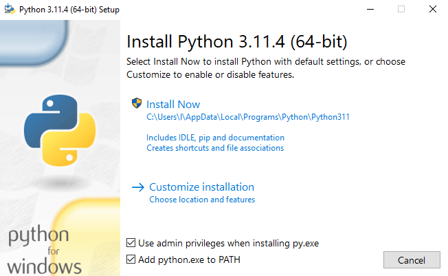
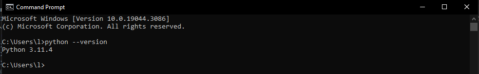
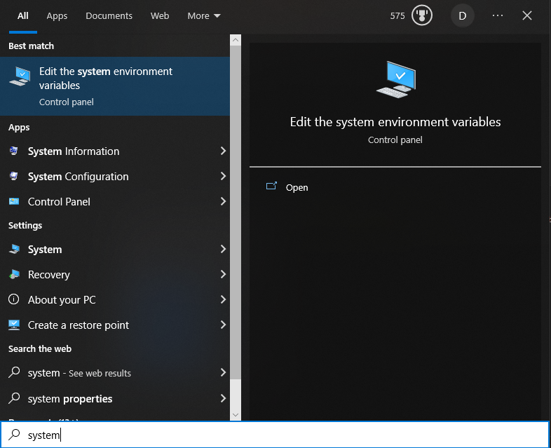
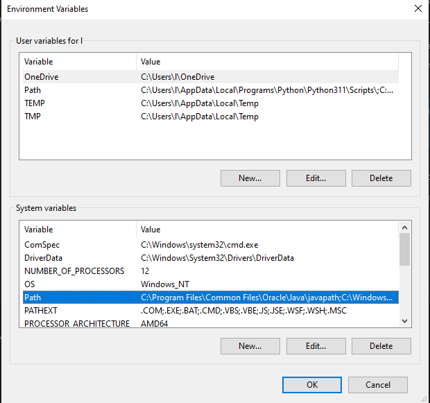
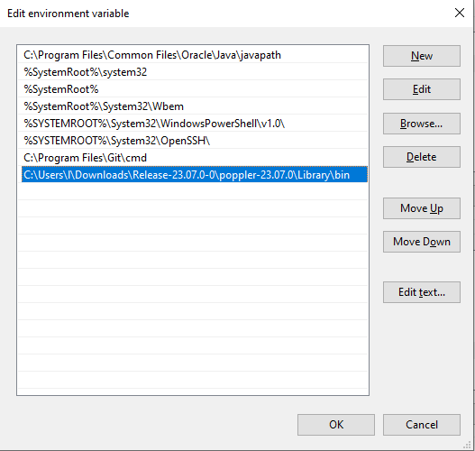
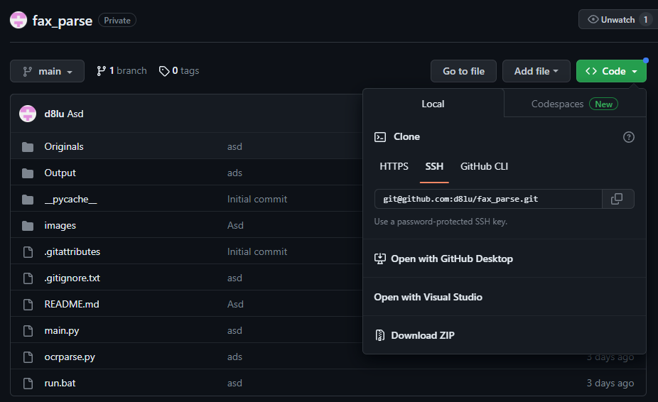

## Installing Python

Install the latest version of Python [here](https://www.python.org/downloads/). After you install, open the executable and follow the instructions. Make sure to click the two checkboxes on the bottom, specifically, ```Add python.exe to Path``` 

Make sure Python is installed properly by going into command prompt and typing ```python --version```. 

## Installing Packages

Next, run the following in command prompt
```
pip install pytesseract 
pip install pdf2image
pip install PyPDF2
```

## Installing Poppler and adding it to PATH
Download the latest release of poppler [here](https://github.com/oschwartz10612/poppler-windows/releases/tag/v23.07.0-0), then extract its contents, and find the ``bin`` sub-folder. For example, I extracted the zip file in ```C:\Users\l\Downloads``` and the path of my ```bin``` folder is ```C:\Users\l\Downloads\Release-23.07.0-0\poppler-23.07.0\Library\bin```. 

Next, we need to add this folder to PATH
1. in Search, search for and select: System (Control Panel) \

2. Click on enviornment variables 
3. Click on the System Path variables \
 
4. Click new and paste the directory of the ```bin``` folder from before. It should look like this: \
 

## Installing the PyTesseract Exectuable

Download the installion wizard for PyTesseract [here](https://github.com/UB-Mannheim/tesseract/wiki). Follow the instructions in the installer and make sure your installion folder is ```C:\Program Files\Tesseract-OCR```

## Running the program
Download the contents of this repository by clicking on the green code button and Download Zip. \
 <br > 


To run the program:
1. Open the ```run``` file
2. Paste any PDFs into the same directory as the ```run``` file
3. Processed PDFs will show up in the Output folder
4. Originals will be moved to the Originals folder
